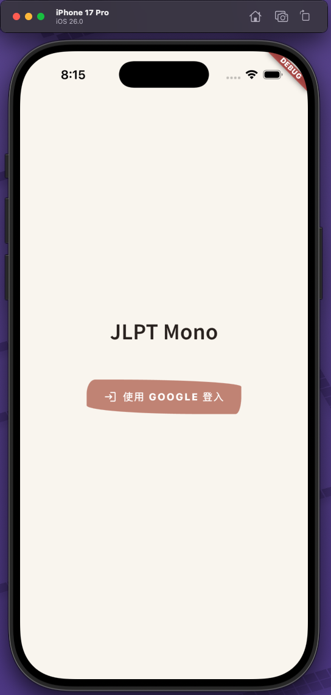
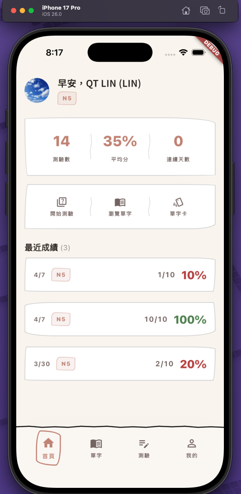
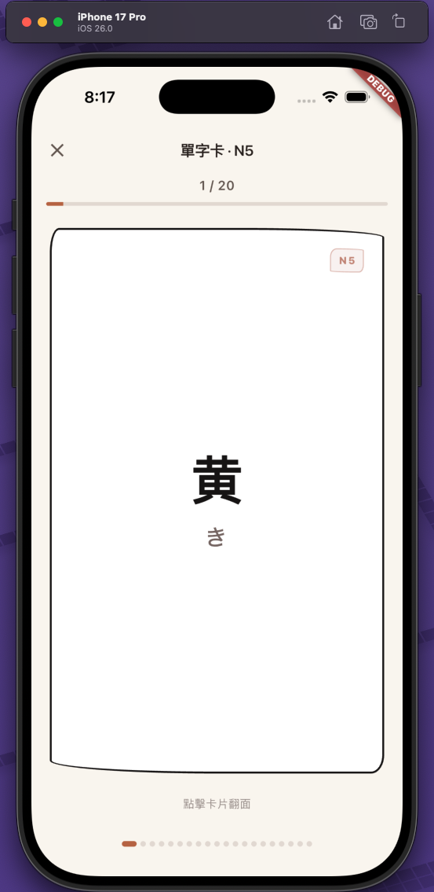
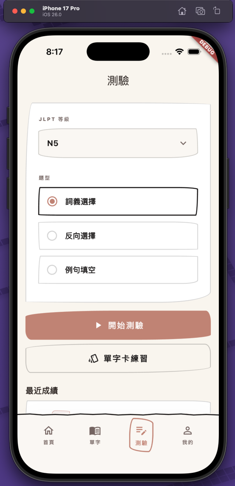
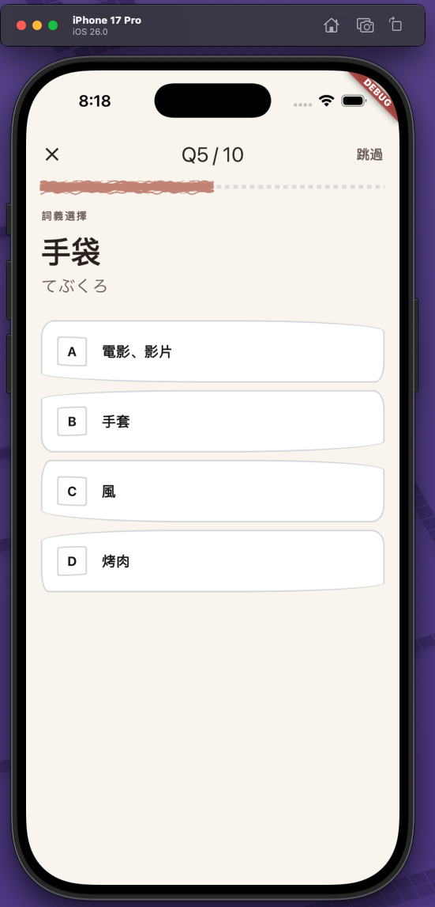
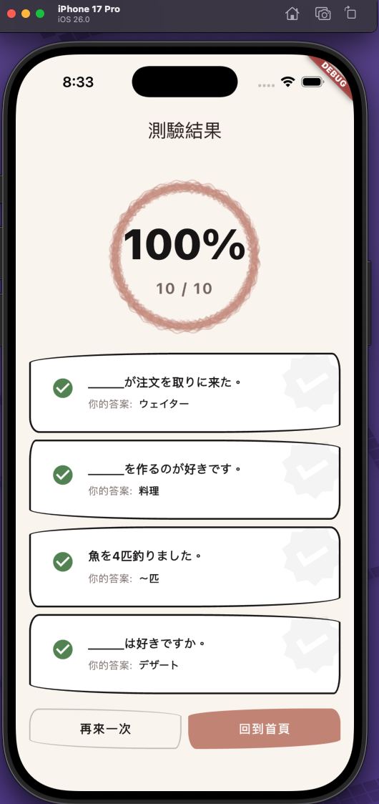
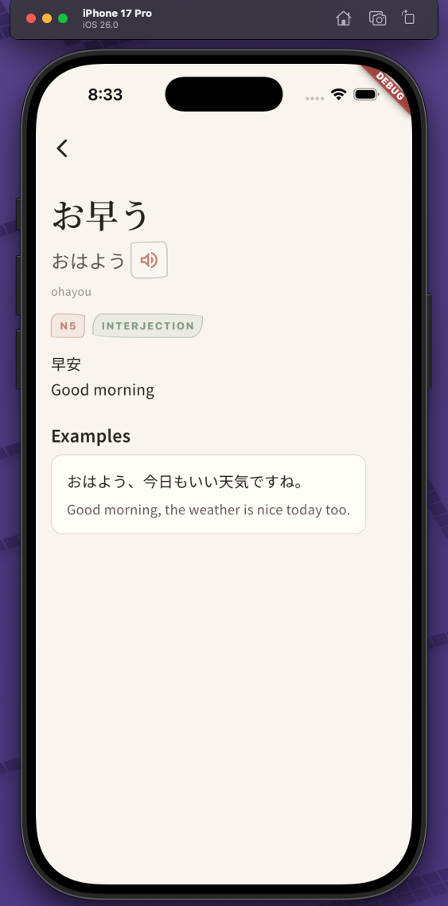
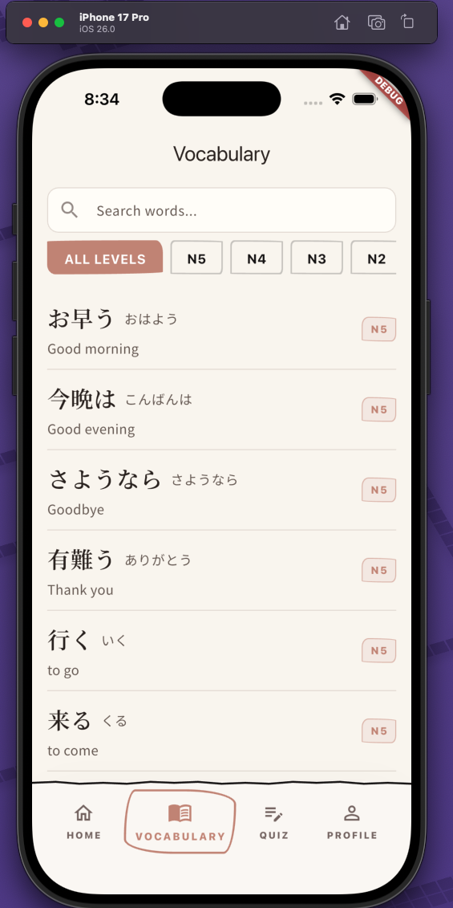

# JLPT Mono

## Screenshots

<table>
  <tr>
    <td width="50%"></td>
    <td width="50%"></td>
  </tr>
  <tr>
    <td></td>
    <td></td>
  </tr>
  <tr>
    <td></td>
    <td></td>
  </tr>
  <tr>
    <td></td>
    <td></td>
  </tr>
</table>

## Prerequisites

- Java 21
- Flutter SDK
- Docker (for PostgreSQL)

## Configuration

The backend requires a local secrets file that is **not committed to version control**.

Copy the example and fill in your values:

```bash
cp backend/src/main/resources/application-local.properties.example \
   backend/src/main/resources/application-local.properties
```


## Backend

```bash
# Start PostgreSQL
cd backend && docker compose -f compose-dev.yaml up -d && cd ..

# Run (from root)
cd backend && ./mvnw spring-boot:run -Dspring-boot.run.profiles=local

# Compile only (from root)
cd backend && ./mvnw compile
```

## Flutter App

```bash
# Install dependencies
cd app && flutter pub get

# Run on iOS simulator
cd app && flutter run -d 4D3E9B39-F419-413C-A6E9-9C018F9B7249 --dart-define-from-file=.env

# Run Widgetbook (component stories) on macOS desktop
cd app && flutter run -d macos -t lib/widgetbook/widgetbook.dart

# Or run Widgetbook on Chrome
cd app && flutter run -d chrome -t lib/widgetbook/widgetbook.dart
```
